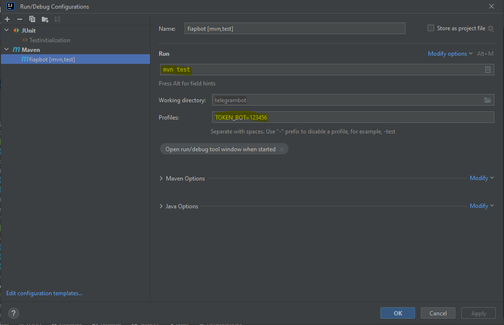

# FIAP / 1SCJR / TelegramBot : FiapBot

---

## Enunciado

Desenvolver um chatbot integrado ao Telegram que consiga responder
a pelo menos cinco mensagens distintas enviadas pelo usuário.
- Bônus 1: Desenvolver as cinco mensagens como se fosse um diálogo
(utilizando uma máquina de estados).
- Bônus 2: Reconhecer padrões de mensagens (via regular
expressions).
- Bônus 3: Integrar esse bot para consultar informações como clima ou
trânsito e devolver para o usuário.
- **Bônus 4:** Entregar a documentação feita em javadoc ou em Markdown
- **Bônus 5:** Construir todo o projeto utilizando o github

---

## Grupo
- RM346958: Thiago de Souza Zanella
- RM346125: Allan Rocha
- RM347277: Gustavo Freitas
- RM346315: Lais Kagawa
- RM346511: Jônatha Lacerda Gonzaga

---

## Repositório Github
- https://github.com/lakagawa/telegrambot

## Configuração do Token

<del>Registre o token no arquivo `src/test/resources/telegramBot.token`</del>

Cadastre a variável de ambiente `TOKEN_BOT` antes de executar.

---

## Funcionalidades

### Multi linguagens

- pt_BR:
- en_US:
- es_ES:

---

#### Fontes

- https://sv443.net/jokeapi/v2/#response-formats
- https://sendpulse.com/knowledge-base/chatbot/regular-expressions
- https://www.regextester.com/97249
- https://www.ometrics.com/support/regular-expression/
- https://www.rexegg.com/regex-quickstart.html
- https://howtodoinjava.com/java/basics/java-naming-conventions/
- https://refactoring.guru/design-patterns/chain-of-responsibility
- https://www.baeldung.com/java-case-insensitive-string-matching
- https://www.unicode.org/emoji/charts/full-emoji-list.html
- https://core.telegram.org/bots/features#keyboards